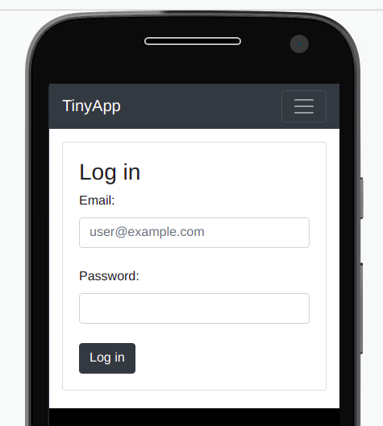
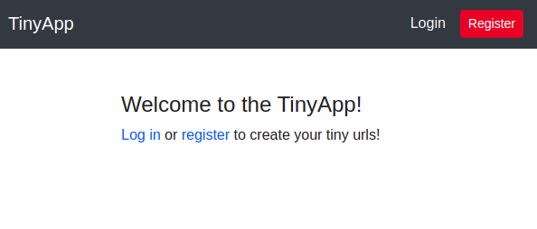
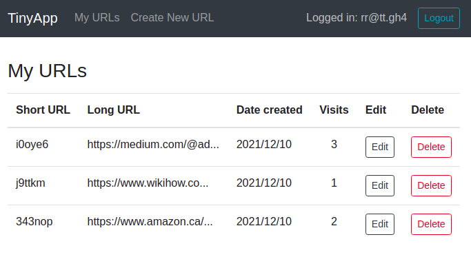

<h1 align="center">
  TinyApp
</h1>
<h3 align="center">A URL shortening app</h3>
<p align="center">
  
  
  
  
</p>

## Description
This is a URL shortening app that was built with Node.js and Express as a week 3 project for the Lighthouse Labs bootcamp.

## Key Features
* Registration and Login with session cookies
* Secure passwords with bcrypt
* Shortening URLs
* Preventing non logged in users from creating/editing/deleting URLs
* Displaying date the URL was created and number of visits
* Mobile responsive

## Project Screenshots
<p align="center">
  
</p>
<p align="center">
  
</p>
<p align="center">
  
</p>

## Built With
* [JavaScript](https://developer.mozilla.org/en-US/docs/Web/JavaScript) - Programming language
* [Express](https://expressjs.com/) - Node.js Web Framework
* [Bootstrap](https://getbootstrap.com/docs/4.2/getting-started/introduction/) - CSS Framework

## Dependencies

*  Node.js
*  Express
*  EJS
*  bcrypt
*  body-parser
*  cookie-session
*  method-override

## Getting Started
Clone the repository:
```
git clone git@github.com:RReiso/tinyapp.git
cd tinyapp
```
Install dependencies:
```
npm install
```
Start the server:
```
npm start
```
You can see the project running at [http://localhost:8080](http://localhost:8080)

## Reflection
This was my first project built with Node.js and Express framework. I learned about routing and creating controllers, hashing passwords with bcrypt, how to make GET and POST requests via HTML forms, how to simulate PUT and DELETE methods with method override and how to set, use and delete cookies.
